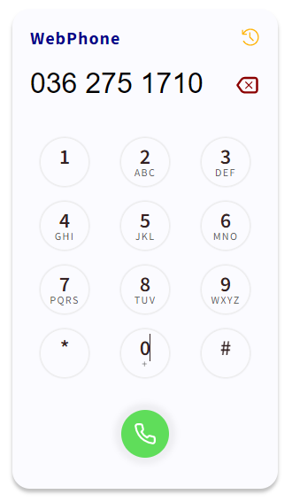
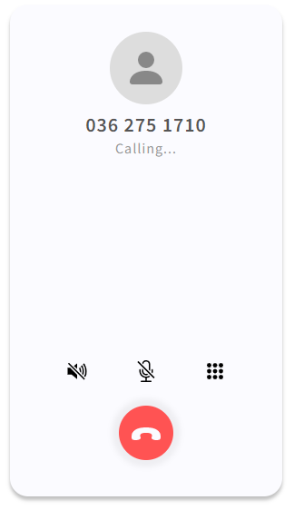
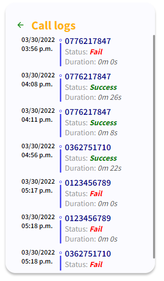

# WebPhone

WebPhone là ứng dụng điện thoại Internet sử dụng
[React.Js](https://reactjs.org/) kết hợp với thư viện
[Jssip](https://jssip.net/). Các tính năng chính của ứng dụng:

- Thực hiện một cuộc gọi đến một thuê bao Việt Nam
  - Hiển thị thời gian cuộc gọi
  - Tắt bật microphone
  - Tắt bật âm thanh
  - Hủy cuộc gọi
- Ghi lại nhật ký các cuộc gọi

## Chạy ứng dụng

### `npm install`

Tải và cài đặt các package cần thiết

### `npm start`

Chạy ứng dụng trên `localhost` với cổng mặc định `3000`

## Sử dụng ứng dụng

Để sử dụng được ứng dụng hãy cho phép trang web có quyền sử dụng âm
thanh, microphone và video.

## Hình ảnh ứng dụng

||
